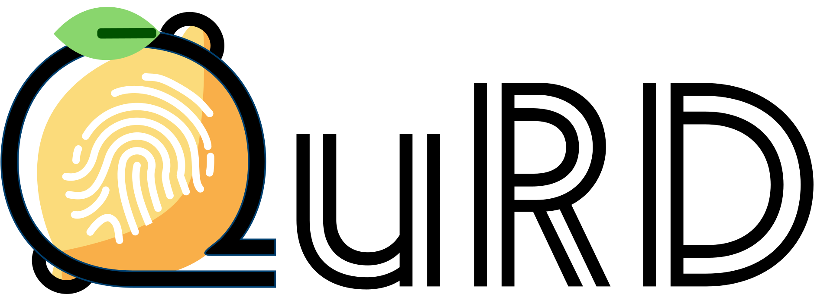

<p align="center">
  
</p>
<p align="left">

# Queries, Representations and Detection: The next 100 Model Fingerprinting Schemes

QuRD is the framework for implementing, and benchmarking model fingerprinting schemes.

**Do you need to use a fingerprinting schemes?** You might be interested in knowing that...\
... QuRD makes it easy to 

**Are you working on fingerprinting schemes?** You might be interested in knowing that...\
.... QuRD makes it easy to *create new fingerprints*.\
.... QuRD makes it easy to *create new benchmarks*.\
.... QuRD makes it easy to *run large scale experiments*.

Here is a simple example that should run a small fingerprinting benchmark on a laptop, without any
GPU. 

```python
from qurd.benchmark import get_benchmark
 
smol_bench = get_benchmark("TinyImageNetModels")
runner = Experiment(smol_bench)
akh_score = make_fingerprint("AKH")

print(runner.scores(akh, budget=10))
```

## Installation

Augustin Godinot made the logo from the following SVGs. No AI involved, just plain [Inkscape](https://inkscape.org) gym.
- https://www.svgrepo.com/svg/220887/fingerprint
- https://www.svgrepo.com/svg/530364/lemon